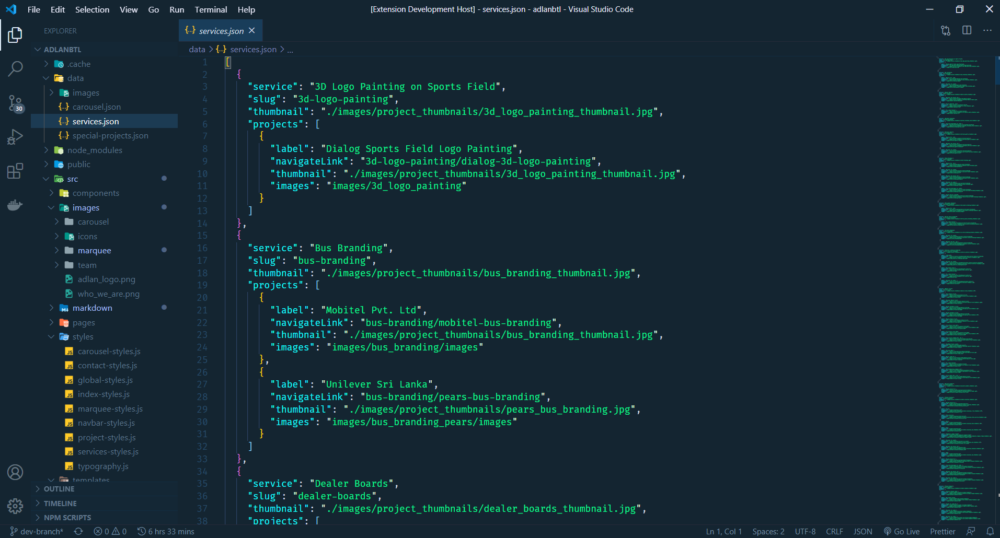

# Vampire Theme 🦇

A Visual Studio Code theme for the night owls out there. This is optimized for those who codes at night. Color choices have taken into consideration what is accessible to people with colorblindness and in low-light circumstances.

About this theme, and some of the considerations made while creating it (as well as _how_ to create it should you want to make your own): [https://css-tricks.com/creating-a-vs-code-theme/](https://css-tricks.com/creating-a-vs-code-theme/)

## Vampire Theme

# Installation

1.  Install [Visual Studio Code](https://code.visualstudio.com/)
2.  Launch Visual Studio Code
3.  Choose **Extensions** from menu
4.  Search for `vampire-theme`
5.  Click **Install** to install it
6.  Click **Reload** to reload the Code
7.  From the menu bar click: Code > Preferences > Color Theme > **Vampire Theme**

## Other versions

The community is awesome and has ported this theme over to other environments.
